# Automatic Master Workflow

## Scope

The Master Workflow is the only component that selects nodes, checks dependencies, validates and
persists artifacts, records durable missing input, and owns pause/resume. Business components
return drafts, signals, and typed results; they do not change workflow state.

```text
POST /api/cases/run
  -> PLANNER_INTAKE
  -> INITIAL_RISK_PRE_SCAN
  -> FINANCE_ASSESSMENT + OPERATIONS_ASSESSMENT concurrently
  -> INITIAL_RISK_FINALIZATION
  -> INITIAL_ASSESSMENT_COMPLETED
  -> DECISION_ROUTE_PLANNING
  -> DECISION_ROUTE_PLANNED
      -> direct route: INTERNAL_DECISION_PACKAGE_ASSEMBLY
      -> Banking route:
           BANKING_DISCOVERY_HANDOFF
           BANKING_INTERNAL_DISCOVERY
           BANKING_PRECHECK_READINESS
           DECISION_POST_BANKING_REVIEW
             -> missing amount: WAITING_FOR_INPUT
             -> ready: BANKING_PRECHECK_READY
                -> BANKING_PRECHECK_SUBMISSION_PROPOSAL
                -> CHECK SUBMIT_BANKING_PRECHECK
                   -> explicit no-human policy and no triggered amount rule:
                      BANKING_PRECHECK_SUBMISSION_AUTHORIZED
                   -> WAITING_FOR_APPROVAL
                   -> approved: BANKING_PRECHECK_SUBMISSION_AUTHORIZED
                      -> BANKING_PRECHECK_EXECUTION (SIMULATED)
                       -> BANKING_PRECHECK_RESULT_SET
                       -> BANKING_PRECHECK_RESULTS_READY
                       -> DECISION_POST_PRECHECK_REVIEW
                          -> conditional full-coverage result:
                             DECISION_DOCUMENT_HANDOFF
                             -> exactly one request: DOCUMENT_PREPARATION
                             -> missing signed contract: WAITING_FOR_INPUT
                             -> document supplement: auto-resume
                             -> DOCUMENT_RELEASE_PACKAGE_READY
                             -> INTERNAL_DECISION_PACKAGE_ASSEMBLY
                          -> other typed result: DECISION_POST_PRECHECK_REVIEW_COMPLETED
                             -> INTERNAL_DECISION_PACKAGE_ASSEMBLY
                   -> rejected: BANKING_PRECHECK_DECLINED
                      -> INTERNAL_DECISION_PACKAGE_ASSEMBLY
             -> no viable option/no precheck path:
                INTERNAL_DECISION_PACKAGE_ASSEMBLY
  -> INTERNAL_DECISION_PACKAGE_READY
     (evidence dossier only; no recommendation, approval, or external send)
```

`BANKING_PRECHECK_READY` is now an internal handoff milestone. The next component creates only a
reference manifest; neither that proposal nor the approval event is itself a precheck result.
Governance derives the gate from the exact proposal and TeamPack API-handling policy. A human
approval or an explicit no-human policy authorization resumes the workflow into a
server-configured simulation. Its result is non-binding and is not a response or approval from a
real bank.

## Detailed flow

```mermaid
flowchart TD
    A[Read configured TeamPack] --> B[Hash and validate read-only dataset]
    B --> C[Build DatasetSnapshot and indexes]
    C --> D[User selects exact contract_id]
    D --> E[POST /api/cases/run]
    E --> F[Create or reuse CaseWorkflowRun]

    F --> G[PLANNER_INTAKE]
    G --> H{Blocking base data missing?}
    H -- Yes --> I[Persist missing request and WAITING_FOR_INPUT]
    H -- No --> J[Persist EVALUATION_CASE and PLANNER_RESULT]

    J --> K[INITIAL_RISK_PRE_SCAN]
    K --> L[Persist RISK_PRE_SCAN and APPROVAL_CHECKPOINTS]
    L --> M[FINANCE_ASSESSMENT]
    L --> N[OPERATIONS_ASSESSMENT]
    M --> O[INITIAL_RISK_FINALIZATION]
    N --> O
    O --> P[Persist final Risk artifacts]
    P --> Q[INITIAL_ASSESSMENT_COMPLETED]

    Q --> R[DECISION_ROUTE_PLANNING]
    R --> S{Explicit Banking need?}
    S -- No --> T[DIRECT_ROUTE]
    S -- Yes --> U[BANKING_DISCOVERY_HANDOFF]
    U --> V[Persist immutable BANKING_DISCOVERY_REQUEST with amount null]
    V --> W[BANKING_INTERNAL_DISCOVERY]
    W --> X[Persist matrix result and advice version one]
    X --> Y[Persist BANKING_PRECHECK_READINESS version one]
    Y --> Z[DECISION_POST_BANKING_REVIEW]
    Z --> AA{Amount required?}
    AA -- Yes --> AB[Persist review and durable MissingDataRequest]
    AB --> AC[WAITING_FOR_INPUT at DECISION_POST_BANKING_REVIEW]
    AA -- No --> AD{Ready option exists?}
    AD -- Yes --> AE[BANKING_PRECHECK_READY]
    AD -- No --> AF{Typed non-ready outcome}
    AF -- No viable option or no precheck path --> AF1[Persist review]
    AF -- Unsupported mapping --> FAILMAP[Fail safe; do not guess policy mapping]

    AE --> AQ[Persist BANKING_PRECHECK_SUBMISSION_PROPOSAL]
    AQ --> AR[Build proposal-scoped policy from TeamPack API facts and Risk amount rule]
    AR --> AS{Governance outcome}
    AS -- Human required --> AT[Persist ApprovalRequest and WAITING_FOR_APPROVAL]
    AT --> AU{Founder decision}
    AU -- Approve --> AV[BANKING_PRECHECK_SUBMISSION_AUTHORIZED]
    AS -- Explicit no-human policy and no amount trigger --> AX[Persist machine authorization]
    AX --> AV
    AV --> AY[Issue exact ephemeral permit]
    AY --> AZ[BANKING_PRECHECK_EXECUTION using SIMULATED adapter]
    AZ --> BA[Validate and persist BANKING_PRECHECK_RESULT_SET]
    BA --> BB[BANKING_PRECHECK_RESULTS_READY]
    BB --> BC[DECISION_POST_PRECHECK_REVIEW]
    BC --> BD{Explicit missing evidence?}
    BD -- Yes --> BE[Persist MissingDataRequest and WAITING_FOR_INPUT]
    BD -- No --> BF{Full-coverage conditional result?}
    BF -- No --> BG0[DECISION_POST_PRECHECK_REVIEW_COMPLETED]
    BF -- Yes --> BG1[DECISION_DOCUMENT_HANDOFF]
    BG1 --> BG2{Number of viable preparation requests}
    BG2 -- Exactly one --> BG3[DOCUMENT_PREPARATION]
    BG2 -- Zero or multiple --> FAIL2[Fail safe; no implicit option selection]
    BG3 --> BG4[Persist DOCUMENT_CHECKLIST and DOCUMENT_PACKAGE_DRAFT]
    BG4 --> BG5{Blocking document missing?}
    BG5 -- Yes --> BG6[WAITING_FOR_INPUT at DOCUMENT_PREPARATION]
    BG6 --> BG7[Accept opaque reference and content SHA-256]
    BG7 --> BG8[Persist DOCUMENT_EVIDENCE_SUPPLEMENT and auto-resume]
    BG8 --> BG3
    BG5 -- No --> BG9[Persist DOCUMENT_RELEASE_PACKAGE]
    BG9 --> BG10[DOCUMENT_RELEASE_PACKAGE_READY]
    BG10 --> IDP[INTERNAL_DECISION_PACKAGE_ASSEMBLY]
    BG0 --> IDP
    T --> IDP
    AF1 --> IDP
    IDP --> IDPR[Persist INTERNAL_DECISION_PACKAGE]
    IDPR --> IDPREADY[INTERNAL_DECISION_PACKAGE_READY]
    IDPREADY --> BG12[No recommendation, approval request, or external send]
    AU -- Reject --> AW[Close Banking route at BANKING_PRECHECK_DECLINED]
    AW --> IDP
    AS -- Missing or invalid policy/input --> FAIL[Fail closed at APPROVAL_GATE]

    BE --> BG[Authorized staff submits evidence reference]
    BG --> BH[Persist BANKING_PRECHECK_EVIDENCE_SUPPLEMENT]
    BH --> BI[Preserve old result and resolve exact MissingDataRequest]
    BI --> BJ[WAITING_FOR_DEPENDENCIES at BANKING_PRECHECK_RETRY_REQUIRED]

    AC --> AG[POST Banking input supplement]
    AG --> AH[Validate exact case workflow and pending request]
    AH --> AI[Persist immutable USER_INPUT supplement]
    AI --> AJ[Resolve missing request and queue same workflow]
    AJ --> AK[Reuse completed upstream nodes]
    AK --> AL[Rerun BANKING_INTERNAL_DISCOVERY with changed input hash]
    AL --> AM[Persist matrix result and advice version two]
    AM --> AN[Persist readiness version two]
    AN --> AO[Run Decision post-Banking review version two]
    AO --> AP{Ready option exists after deterministic checks?}
    AP -- Yes --> AE
    AP -- No --> AF
```



Risk pre-scan runs before the parallel tasks so future approval checkpoints exist early. Finance
and Operations then run concurrently. Risk finalization waits for both fact artifacts. This
dependency wait is Workflow state, not a Risk component pause.

## Banking input lifecycle

The initial `BANKING_DISCOVERY_REQUEST` always keeps `requested_amount: null`. Initial Banking
discovery produces matrix version 1 with amount unavailable and `MINIMUM_AMOUNT = NOT_EVALUABLE`.
Banking nevertheless creates `BANKING_PRECHECK_READINESS`; Decision uses it to create the exact
missing-data request.

The Master run then contains:

```text
status                   = WAITING_FOR_INPUT
current_stage            = DECISION_POST_BANKING_REVIEW
resume_stage             = DECISION_POST_BANKING_REVIEW
pending_missing_data_ids = [MDR-...]
```

Input is submitted through:

```http
POST /api/cases/{evaluation_case_id}/banking/input-supplements
```

```json
{
  "workflow_run_id": "CWF-...",
  "missing_request_id": "MDR-...",
  "requested_amount": 350000000,
  "requested_amount_currency": "VND",
  "evidence_note": "Amount confirmed for readiness assessment."
}
```

The numeric amount is illustrative user input, not a default and not a value inferred from the
contract.

The server accepts only a strict positive integer and `VND`. It derives dataset, contract, case,
Banking request identity, and the current prototype staff principal `AUTHORIZED_STAFF`; the client
cannot claim to be Founder or another principal. It validates that the missing request is still
open for the same run and persists `BANKING_INPUT_SUPPLEMENT` with `USER_INPUT` evidence. The
`202` response returns the supplement, a compact artifact reference, and a workflow status pointer.

Successful supplement persistence resolves the missing request and queues the same workflow. No
separate generic-resume call is needed. Supplying evidence is not approval.

## Explicit precheck field sources

Readiness uses only server-policy mappings:

```text
contract_id      -> EVALUATION_CASE
amount           -> BANKING_INPUT_SUPPLEMENT
company_profile  -> 02_OPC_PROFILE
```

`12_API_CATALOG.required_fields` is compared with this mapping but does not create source
relationships. `10_CREDIT_PROFILE` is not substituted for `company_profile`, and descriptive text
does not link a credit case to a contract.

## Artifact flow and immutability

```text
DatasetSnapshot
  -> EVALUATION_CASE + PLANNER_RESULT
  -> RISK_PRE_SCAN + APPROVAL_CHECKPOINTS
  -> FINANCE_FACTS + FINANCE_ASSESSMENT
  -> OPERATIONS_FACTS + OPERATIONS_ASSESSMENT
  -> RISK_RULE_EVALUATION + INITIAL_RISK_ASSESSMENT
  -> DECISION_ROUTE_PLAN
  -> BANKING_DISCOVERY_REQUEST v1 (amount null)
  -> BANKING_OPTION_MATRIX + BANKING_DISCOVERY_RESULT v1
  -> BANKING_OPTION_ADVICE v1
  -> BANKING_PRECHECK_READINESS v1
  -> DECISION_POST_BANKING_REVIEW v1 + MissingDataRequest
  -> BANKING_INPUT_SUPPLEMENT v1
  -> BANKING_OPTION_MATRIX + BANKING_DISCOVERY_RESULT v2
  -> BANKING_OPTION_ADVICE v2
  -> BANKING_PRECHECK_READINESS v2
  -> DECISION_POST_BANKING_REVIEW v2
      -> ready option: BANKING_PRECHECK_READY
         -> BANKING_PRECHECK_SUBMISSION_PROPOSAL v1
         -> proposal-scoped APPROVAL_CHECKPOINTS
             -> human required: ApprovalRequest(PENDING) + WAITING_FOR_APPROVAL
                 -> approve: BANKING_PRECHECK_SUBMISSION_AUTHORIZED
                 -> reject: BANKING_PRECHECK_DECLINED
             -> explicit no-human/no amount trigger:
                 ApprovalRequest(AUTHORIZED_WITHOUT_HUMAN)
                 -> BANKING_PRECHECK_SUBMISSION_AUTHORIZED
         -> authorized branch: BANKING_PRECHECK_EXECUTION (SIMULATED)
         -> BANKING_PRECHECK_RESULT_SET v1
         -> BANKING_PRECHECK_RESULTS_READY
         -> DECISION_POST_PRECHECK_REVIEW v1
             -> no explicit gap: DECISION_POST_PRECHECK_REVIEW_COMPLETED
                -> INTERNAL_DECISION_PACKAGE_ASSEMBLY
             -> explicit missing evidence: WAITING_FOR_INPUT
                 -> BANKING_PRECHECK_EVIDENCE_SUPPLEMENT
                 -> BANKING_PRECHECK_RETRY_REQUIRED
      -> no ready option: typed non-ready outcome
         -> INTERNAL_DECISION_PACKAGE_ASSEMBLY
  -> INTERNAL_DECISION_PACKAGE_READY
```

No earlier artifact is updated in place. Matrix version 1 preserves the original null amount and
`NOT_EVALUABLE` criterion. Matrix version 2 traces the supplied amount to the supplement and records
the deterministic `PASS` or `FAIL` result. The latest summary points to the newest versions while
older envelopes remain auditable.

## Idempotency, invalidation, and recovery

`workflow_run_id` depends on dataset snapshot, contract, requested Initial Assessment scope, and
explicit `as_of_date`. Repeating the same start request returns the same run.

Banking node identity includes explicit upstream artifacts, catalog-policy hash, advisor
configuration hash, and the accepted supplement when one exists. Therefore:

- before input, unchanged work reuses version 1;
- after input, the changed hash reruns Banking Phase A and creates version 2;
- completed Planner, Finance, Operations, Risk, Initial Route, and handoff nodes are reused;
- an identical supplement retry does not create version 3; and
- a conflicting supplement cannot overwrite accepted evidence;
- Phase B1 request identity binds the permit, proposal envelope, proposal item, and canonical
  request hash; and
- an identical authorized execution reuses the same validated result set instead of invoking a
  second logical simulation; and
- Internal Decision Package identity depends on its assembly path, exact validated source-envelope
  identities, and stable rejected-decision substance. Full Governance audit references remain in
  the payload, while workflow/request IDs and timestamps are excluded from artifact identity.

This is narrow, explicit supplement-driven invalidation. It is not generic transitive `STALE` or
arbitrary DataPatch support.

SQLite-backed run, node, artifact, missing-data, approval, and event state survive API restarts.
The runner recovers matching `PENDING` or interrupted `RUNNING` work. A run intentionally waiting
for input remains waiting until the exact request is resolved; once the supplement changes it to
pending, recovery can continue it.

## Document input, masking, and Internal Decision handoff

The current conditional `API-002` scenario is server-owned mock data; the TeamPack has no real
VietinBank response. It declares four document requirements. Structured company profile and an
unsigned request-form draft are available internally, cashflow evidence keeps its OPC-global
limitation, and `SIGNED_CONTRACT` blocks the package until an exact reference is supplied.

Document intake accepts an opaque `document_reference_id`, a SHA-256 content digest, the exact
pending request/type, and an evidence note. It does not accept bytes, URL, or filesystem path.
Resolving the request creates a new supplement and package version; prior artifacts are immutable.

Before `DOCUMENT_RELEASE_PACKAGE` is created, payload construction applies minimum-field selection,
exact data classification and deterministic masking. Restricted identifiers use contextual
HMAC-SHA256 namespace `provider | purpose | field | key_version`; runtime key material must be at
least 32 bytes, while token output is at least 128 bits. Missing key or unknown policy/field fails
closed. Tokenization is pseudonymization, not anonymization. Sheet `21_MASKING_EXAMPLES` is only
example data and never executable masking policy.

The current composition root requires exact `company_id` and `company_name` profile fields. This is
a documented server assumption, not a VietinBank requirement proven by TeamPack. Partial provider
coverage is deferred, and the workflow does not silently select among multiple viable handoffs.

## API

Start and inspect:

```http
POST /api/cases/run
GET  /api/workflows/{workflow_run_id}
GET  /api/workflows/{workflow_run_id}/events?after_sequence=0
```

Resolve the Banking amount request and auto-resume:

```http
POST /api/cases/{evaluation_case_id}/banking/input-supplements
```

Resolve one explicit post-precheck evidence request without rewriting the old provider result:

```http
POST /api/cases/{evaluation_case_id}/banking/precheck-evidence-supplements
```

Resolve one exact Document missing-data request with reference metadata and auto-resume:

```http
POST /api/cases/{evaluation_case_id}/documents/evidence-supplements
```

Inspect and resolve a genuine pending Founder request, such as the governed Banking-precheck
proposal:

```http
GET  /api/cases/{evaluation_case_id}/artifacts
GET  /api/cases/{evaluation_case_id}/approval-requests
POST /api/approval-requests/{request_id}/decision
```

The generic protected-action endpoint cannot manually create `SUBMIT_BANKING_PRECHECK` or
`SEND_DOCUMENT_TO_EXTERNAL_PARTNER`. Banking precheck is accepted only from its exact validated
proposal node. Document package readiness does not propose the latter action; it remains dormant
until a future validated Decision proposal exists.

The generic endpoint remains for other genuine waits or changed failure conditions:

```http
POST /api/workflows/{workflow_run_id}/resume
```

It must not be used to clear an unresolved Banking amount request.

Standalone component endpoints remain available for Swagger inspection, but the Master Workflow
does not require the user to invoke each component manually.

## Approval boundary

Initial Risk registers only evidence-backed future checkpoints from Risk rules such as `RR-004`
and `RR-005`; registration alone never pauses the workflow. It does not create a global hard-coded
Banking-precheck checkpoint. After the exact proposal is persisted, Governance reads the
proposal-carried facts from `12_API_CATALOG` and the explicitly mapped `22_API_HANDLING_RULES`,
then creates a proposal-scoped policy artifact. Missing, ambiguous, or unsupported policy fails
closed.

For each proposal API, the policy records one `ApprovalPolicyCoverage` containing the API ID,
`12_API_CATALOG.extension_rule`, and exact mapped sheet-22 `rule_id`, `applies_to`,
`requires_human_approval`, and evidence IDs. The amount checkpoint preserves the source Risk rule
ID, operator, threshold, and evidence; Governance does not translate `>` into `>=`.

After Decision reports a ready route, Banking batches every READY option into a validated,
reference-only proposal. The Orchestrator persists that proposal first, creates an `ActionCommand`
referencing its immutable envelope, and asks Governance to evaluate all applicable controls. For
the current TeamPack, `API-002` explicitly requires human approval before submission; when the
amount is also greater than the `RR-005` threshold, both controls are retained in the same Founder
request. At the exact threshold, the `>` rule is not triggered, although the API policy can still
require Founder approval. If a future valid API policy explicitly says no human approval and no
amount rule triggers, Governance persists `AUTHORIZED_WITHOUT_HUMAN` instead of silently bypassing
the gate. Either authorization is bound to the exact policy and proposal ID, version, and hash.

Founder approval authorizes only `SUBMIT_BANKING_PRECHECK` for that proposal. It does not authorize
a final commitment, external document release, bank/product selection, or final contract decision.
Founder rejection closes only the Banking route at `BANKING_PRECHECK_DECLINED`, creates no precheck
result set, does not invoke the adapter, and does not block the whole case. Workflow then preserves
the exact rejected request as a Governance reference while assembling the Internal Decision
Package. That reference records what happened; it is not a new approval request or an instruction
to reverse the decision.

The server configuration currently maps `API-002`/`VietinBank` to a controlled
`CONDITIONAL_PRECHECK` with `SIMULATED_CONDITIONAL_PRECHECK`, `ELIGIBLE`, conditional guarantee,
VND, an echoed requested amount and exact document/condition codes. It always remains
`SIMULATED_NON_BINDING`; the TeamPack has no real VietinBank response. Missing API/provider
scenarios produce `SERVICE_UNAVAILABLE`, never an invented recommendation. The request body and
sensitive company profile remain in-memory adapter inputs and are not raw fields of
`BANKING_PRECHECK_RESULT_SET`.

When the conditional result is full coverage, Decision can create one preparation request per
viable result. It does not select. Master Workflow continues only when exactly one request exists;
zero or multiple requests fail safe. Partial coverage is deferred. This rule prevents array order
or demo data from becoming an accidental banking decision.

Document preparation is a separate internal capability. Missing `SIGNED_CONTRACT` creates a
blocking request and pauses the same workflow. Resolving it with an exact opaque document reference
and content SHA-256 creates an immutable supplement and rebuilds the package. A ready
`DOCUMENT_RELEASE_PACKAGE` is persisted as the masked Document input for Internal Decision Package
assembly. It does not trigger Governance, create an ApprovalRequest, or authorize an external
send. The registered `SEND_DOCUMENT_TO_EXTERNAL_PARTNER` checkpoint stays dormant. Precheck
authorization cannot be reused; only a later evidence-bound Decision recommendation/proposal may
activate that separate checkpoint.

## Internal Decision Package convergence and current boundary

Every eligible nonblocked Decision branch now converges at
`INTERNAL_DECISION_PACKAGE_ASSEMBLY`: direct route, no viable Banking option, no configured
precheck path, Founder-declined Banking precheck, non-actionable precheck result, or a conditional
Document path with a ready masked release package. A pending input, pending approval, unsupported
mapping, masking failure, or other failed-safe state cannot produce a partial package.

The resulting `INTERNAL_DECISION_PACKAGE` is a deterministic snapshot of already validated
evidence and branch outcomes. It creates no new Finance/Risk facts, performs no bank/product
selection, and makes no accept/negotiate/reject recommendation. It creates no `ActionCommand` or
`ApprovalRequest` and keeps `recommendation_performed`, `selection_performed`,
`approval_requested`, and `external_action_performed` false. The successful workflow milestone is
`INTERNAL_DECISION_PACKAGE_READY`.

For the conditional Document branch, the source `DOCUMENT_RELEASE_PACKAGE` still has
`document_release_authorized = false` and `document_external_release_performed = false`. No real
external precheck/API call, external document send, partial-coverage optimizer, Final Risk Check,
deterministic final recommendation/proposal, or Decision Card is implemented. See
[Internal Decision Package](INTERNAL_DECISION_PACKAGE.md) for exact path and source rules.
